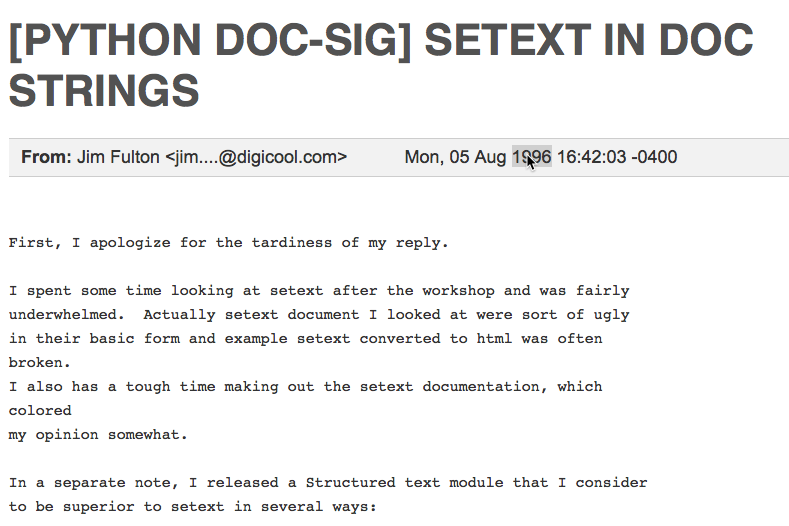

# Customizing Sphinx

### Simple, Normal, Hard

##### Paul Everitt, @paulweveritt

Follow Along: URL

----  ----

## About Me

- PyCharm Developer Advocate
- Go back a ways in Python

----

## Raise Your Hand If You...


* Have ever written Sphinx docs? <!-- .element: class="fragment" -->
* Customized a Sphinx site? <!-- .element: class="fragment" -->
* Written a Sphinx extension? <!-- .element: class="fragment"-->
* Cursed because the RST docs are on a SourceForge page which is down for weeks cuz lolz sourceforge <!-- .element: class="fragment" --> 

----

## Today

- Sphinx: the tool, the engine
- Simple (``conf.py``)
- Normal (overrides)
- Hard (extensions)

----

### About Sphinx

- Static site generator
- Documentation and more
- Several killer features
    - Intra/inter-linking
- Extensible, but crazy-old stack

----




----  ----

## 1. Simple: Configuration

- Change some configuration values
- Change some theme options

----  ----

### 1a. conf.py

- TODO include some conf.py

Note:
- Sphinx is driven by conf file

----

### If your site looks like this...

- TODO screenshot

----

### ...and we change project title

```python
# -- Project information ---------------------

project = 'Customizing Sphinx'
copyright = '2018, Paul Everitt <pauleveritt@me.com>'
author = 'Paul Everitt <pauleveritt@me.com>'

# The short X.Y version
version = ''
# The full version, including alpha/beta/rc tags
release = ''
```

<span class="fragment" data-code-focus="1">
...from this:
</span>

----

### ...and we change project title

```python
project = 'Customizing Sphinx'
copyright = '2018, Paul Everitt <pauleveritt@me.com>'
author = 'Paul Everitt <pauleveritt@me.com>'

# The short X.Y version
version = ''
# The full version, including alpha/beta/rc tags
release = ''
```

<span class="fragment" data-code-focus="1">
...to this:
</span>


----

### After rebuilding, looks like:

TODO screenshot


----

### What other knobs can I change?

TODO code snippet of some other knobs.

----  ----


### 1b. Change some theme options

```python
# -- Options for HTML output -------------------------------------------------

# The theme to use for HTML and HTML Help pages.  See the documentation for
# a list of builtin themes.
#
html_theme = 'alabaster'

# Theme options are theme-specific and customize the look and feel of a theme
# further.  For a list of options available for each theme, see the
# documentation.
#
# html_theme_options = {}
```

- Theme: Another thing I can change
- Where are the ``html_theme_options``?

Notes:
- Good luck finding them

----

### Sphinx HTML theming

TODO screenshot of Sphinx HTML theming page

Notes:
- Show the theme.conf part

----

### Alabaster Customization

TODO Screenshot http://alabaster.readthedocs.io/en/latest/customization.html

Alabaster has lots of ways to customize.

----

### Its theme options are documented:

TODO screenshot of http://alabaster.readthedocs.io/en/latest/customization.html#theme-options

----

### Its ``theme.conf`` file

TODO https://github.com/bitprophet/alabaster/blob/master/alabaster/theme.conf

Because docs get out of date.

Notes:
- This is a mini-DSL with a validation system


----

### If I change the page width

TODO conf.py with html_theme_options


----

### It looks like this

TODO screenshot

----

#### alabaster/static/alabaster.css_t

TODO screenshot of https://github.com/bitprophet/alabaster/blob/master/alabaster/static/alabaster.css_t#L58

---- 

#### Let's make an error

TODO conf.py with invalid option and highlighting

----

### Rebuild shows

TODO code-block bash of terminal with error in build


----  ----

## 2. Normal: Customizing

- Override a template
- Add some CSS
- Install an extension
- Install a content-oriented extension

----  ----


### 2a. Override a template

TODO Annotated screenshot of where to put a paragraph

I'd like to put a paragraph there.
 

----

### Hold on to your butts

TODO giphy for hold onto your butts


----

### ``albaster/layout.html``
 
```html+jinja 



  {{ super() }}
  <link rel="stylesheet" href="{{ pathto('_static/custom.css', 1) }}" type="text/css" />
  
    <link rel="apple-touch-icon" href="{{ pathto('_static/' ~ theme_touch_icon, 1) }}" />
  
  
    <link rel="canonical" href="{{ theme_canonical_url }}{{ pagename }}.html"/>
  
  <meta name="viewport" content="width=device-width, initial-scale=0.9, maximum-scale=0.9" />


{# top+bottom related navs; we also have our own in sidebar #}

  <nav id="rellinks">
    <ul>
      
        <li>
          &larr;
          <a href="{{ prev.link|e }}" title="Previous document">{{ prev.title }}</a>
        </li>
      
      
        <li>
          <a href="{{ next.link|e }}" title="Next document">{{ next.title }}</a>
          &rarr;
        </li>
      
    </ul>
  </nav>





{# removed existing top+bottom related nav, and embed in main content #}



{# Nav should appear before content, not after #}


  <div class="document">
    {{ sidebar() }}
    
      <div class="documentwrapper">
      
        <div class="bodywrapper">
      

          
            
              <div class="related top">
                &nbsp;
                {{- rellink_markup () }}
              </div>
            
          

          <div class="body" role="main">
             
          </div>

          
            
              <div class="related bottom">
                &nbsp;
                {{- rellink_markup () }}
              </div>
            
          

      
        </div>
      
      </div>
    
    <div class="clearer"></div>
  </div>

{{ super() }}


```

- It extends basic/layout.html <!-- .element: class="fragment"  data-code-focus="1" -->
- It fills the content block <!-- .element: class="fragment" data-code-focus="43" -->
- By default, gets sidebar from super() <!-- .element: class="fragment" data-code-focus="82" --> 

----

### ``basic/layout.html``

```html+jinja 
{#
    basic/layout.html
    ~~~~~~~~~~~~~~~~~

    Master layout template for Sphinx themes.

    :copyright: Copyright 2007-2018 by the Sphinx team, see AUTHORS.
    :license: BSD, see LICENSE for details.
#}

<!DOCTYPE html>

<!DOCTYPE html PUBLIC "-//W3C//DTD XHTML 1.0 Transitional//EN"
  "http://www.w3.org/TR/xhtml1/DTD/xhtml1-transitional.dtd">





{# XXX necessary? #}


  

  



    <div class="related" role="navigation" aria-label="related navigation">
      <h3>{{ _('Navigation') }}</h3>
      <ul>
        
        <li class="right" style="margin-right: 10px">
          <a href="{{ pathto(rellink[0]) }}" title="{{ rellink[1]|striptags|e }}"
             {{ accesskey(rellink[2]) }}>{{ rellink[3] }}</a>
          {{ reldelim2 }}</li>
        
        
        <li class="nav-item nav-item-0"><a href="{{ pathto(master_doc) }}">{{ shorttitle|e }}</a>{{ reldelim1 }}</li>
        
        
          <li class="nav-item nav-item-{{ loop.index }}"><a href="{{ parent.link|e }}" {{ accesskey("U") }}>{{ parent.title }}</a>{{ reldelim1 }}</li>
        
         
      </ul>
    </div>



      
      <div class="sphinxsidebar" role="navigation" aria-label="main navigation">
        <div class="sphinxsidebarwrapper">
          
          
            <p class="logo"><a href="{{ pathto(master_doc) }}">
              
            </a></p>
          
          
          
            {#- new style sidebar: explicitly include/exclude templates #}
            
            
            
          
            {#- old style sidebars: using blocks -- should be deprecated #}
            
            
            
            
            
            
            
            
            
            
            
            
            
            
            
          
        </div>
      </div>
      



    <script type="text/javascript" id="documentation_options" data-url_root="{{ pathto('', 1) }}" src="{{ pathto('_static/documentation_options.js', 1) }}"></script>
    
    <script type="text/javascript" src="{{ pathto(scriptfile, 1) }}"></script>
    



    <link rel="stylesheet" href="{{ pathto('_static/' + style, 1) }}" type="text/css" />
    <link rel="stylesheet" href="{{ pathto('_static/pygments.css', 1) }}" type="text/css" />
    
      
    <link rel="{{ css.rel }}" href="{{ pathto(css.filename, 1) }}" type="text/css" title="{{ css.title }}" />
      
    <link rel="stylesheet" href="{{ pathto(css, 1) }}" type="text/css" />
      
    



{{ html_tag }}

<html xmlns="http://www.w3.org/1999/xhtml" lang="{{ language }}">

  <head>
    
    <meta http-equiv="X-UA-Compatible" content="IE=Edge" />
    
    
    <meta charset="{{ encoding }}" />
    
    <meta http-equiv="Content-Type" content="text/html; charset={{ encoding }}" />
    
    {{- metatags }}
    
    <title>{{ title|striptags|e }}{{ titlesuffix }}</title>
    
    
    {{- css() }}
    
    
    
    {{- script() }}
    
    
    <link rel="search" type="application/opensearchdescription+xml"
          title="Search within {{ docstitle }}"
          href="{{ pathto('_static/opensearch.xml', 1) }}"/>
    
    
    <link rel="shortcut icon" href="{{ pathto('_static/' + favicon, 1) }}"/>
    
    

    
    <link rel="author" title="{{ _('About these documents') }}" href="{{ pathto('about') }}" />
    
    
    <link rel="index" title="{{ _('Index') }}" href="{{ pathto('genindex') }}" />
    
    
    <link rel="search" title="{{ _('Search') }}" href="{{ pathto('search') }}" />
    
    
    <link rel="copyright" title="{{ _('Copyright') }}" href="{{ pathto('copyright') }}" />
    
    
    <link rel="next" title="{{ next.title|striptags|e }}" href="{{ next.link|e }}" />
    
    
    <link rel="prev" title="{{ prev.title|striptags|e }}" href="{{ prev.link|e }}" />
    

 
  </head>
  <body>


{{ relbar() }}


   {# possible location for sidebar #} 

    <div class="document">
  
      <div class="documentwrapper">
      
        <div class="bodywrapper">
      
          <div class="body" role="main">
             
          </div>
      
        </div>
      
      </div>
  

  {{ sidebar() }}
      <div class="clearer"></div>
    </div>


{{ relbar() }}


    <div class="footer" role="contentinfo">
    
      
        &#169; <a href="{{ path }}">Copyright</a> {{ copyright }}.
      
        &#169; Copyright {{ copyright }}.
      
    
    
      Last updated on {{ last_updated }}.
    
    
      Created using <a href="http://sphinx-doc.org/">Sphinx</a> {{ sphinx_version }}.
    
    </div>

  </body>
</html>
```

- Content block calls sidebar macro <!-- .element: class="fragment"  data-code-focus="187" -->
- The sidebar macro... <!-- .element: class="fragment" data-code-focus="50" -->
- ...has newstyle, loops through sidebars <!-- .element: class="fragment" data-code-focus="63" --> 


----

## Sidebars?

TODO giphy of wtf

----

### Magic variable from ``html_theme_options``

TODO Screenshot of sphinx html theming page http://www.sphinx-doc.org/en/stable/config.html#confval-html_sidebars

- Circle "relations.html"

----

## ``_templates/relations.html``

TODO include source which has my stuff and calls super

- Override the layer-layer

----

## Results in...

TODO screenshot

----

## Aside: Magic

TODO Picture of wizard blowing up in face: As Uncle Timmy always said...explicit is better than implicit"

- A brief taste of the layers of magic
- Template blocks/macros/layouts, layers, theme conf
- Vast ecosystem of informal, inconsistent, implicit conventions

----  ----

### 2b. Add some CSS

I'd like to style that my-addition in the sidebar.

----

### Solution? Magical Magic!

TODO Screenshot of http://www.sphinx-doc.org/en/stable/config.html#confval-html_static_path

----

### ``_static/mystyles.css``

TODO Inline the CSS

----

### Edit ``conf.py``

TODO Inline the conf.py setting

----

### Et voilà

TODO Screenshot of styled box

----

### Dynamic CSS?

- Sure, why not
- ``_static/mystyles.css_t``
- Becomes a Jinja2 template

----  ----


### 2c. Install a new extension

Let's change to a Bootstrap theme.


----

### Install package

TODO fenced block for pip

----

### Configure in ``conf.py``

TODO fenced block for conf.py

- Fragment for extensions
- Fragment for connect as theme
- Fragment for configure some options

----

### Your Sphinx looks different

TODO screenshot of new site


----  ----


### 2d. Other Extensions

- New directive
- New builders
- Your own crazy thing

----  ----

## 3. Hard: Extending

----  ----


### What is an extension?

- Package with a __init__.setup() function that gets passed app
- Registers new kinds of things
- Listens for for events

----

### Example: Alabaster

TODO fenced block for setup()


----

### Todo example

TODO hyperlink and screenshot of Sphinx todo page

---- ----

### Let's write an extension

Hello World directive. Of course.

----

### ``customizing_sphinx/helloworld.py``

TODO code block of directive

----

### ``customizing_sphinx/__init__.py``

TODO code block of setup.py

----

### Add it to ``conf.py``

TODO code block of conf.py

----

### We now have a new directive...

TODO Show an RST document

----

### ...which renders in a page

TODO Screenshot of helloworld

----

### Wrong usage, and...

TODO code of rst without argument

----

### ...Sphinx warns us

TODO bash output of running sphinx with error

----

### Don't be stupid, write tests

- The cycle of code, run Sphinx, look at browser...sucks.

- Sphinx has a pytest fixture

---- 

### ``tests/confdir.py``

TODO Code for fixture

---- 

#### tests/test_helloworld.py

TODO code snippet for test

---- ----

## Any Questions?

TODO giphy of Just Kidding

- I know, that was a lot, but...
- URL to repo

----  ----

### Conclusion

- Sphinx is big, powerful, old, crazy
- Under-appreciated as Python's secret weapon
- Contact me: hallway, sprint, open space, @paulweveritt 

