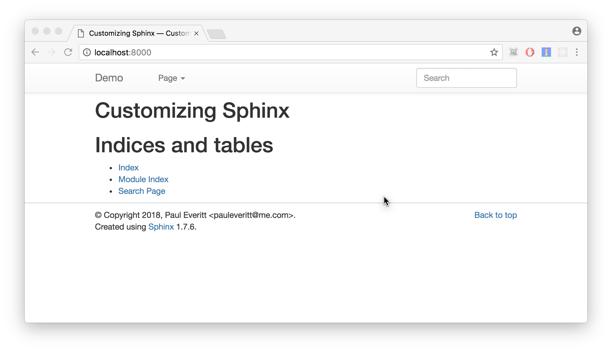

# Customizing Sphinx

### Simple, Normal, Hard

##### Paul Everitt, @paulweveritt

Repo: URL

----  ----

## About Me

- PyCharm Developer Advocate
- Go back a ways in Python

----  ----

### Alternative Presentation Format

<video alt="driving fox tv GIF by Empire FOX" src="videos/giphy.mp4" poster="videos/buckleup.gif" autoplay="" loop="" playsinline="" style="width: 580px; height: 369.76px; left: 0px; top: 0px;"></video>

Follow Along: URL

----

## Raise Your Hand If You...


* Have ever written Sphinx docs? <!-- .element: class="fragment" -->
* Customized a Sphinx site? <!-- .element: class="fragment" -->
* Written a Sphinx extension? <!-- .element: class="fragment"-->
* Cursed because the RST docs are on a SourceForge page which is down for weeks cuz lolz sourceforge <!-- .element: class="fragment" --> 

----

## Today

- Sphinx: the tool, the engine
- Simple (``conf.py``)
- Normal (overrides)
- Hard (extensions)

----

### About Sphinx

- Static site generator
- Documentation and more
- Several killer features
    - Intra/inter-linking
- Extensible, but crazy-old stack

----


----  ----

## 1. Simple: Configuration

- Change some configuration values
- Change HTML theme options

----  ----

### 1a. conf.py

```python
# -- Project information -----------------------------------------------------

project = 'Customizing Sphinx'
copyright = '2018, Paul Everitt <pauleveritt@me.com>'
author = 'Paul Everitt <pauleveritt@me.com>'

# The short X.Y version
version = ''
# The full version, including alpha/beta/rc tags
release = ''


# -- General configuration ---------------------------------------------------

# If your documentation needs a minimal Sphinx version, state it here.
#
# needs_sphinx = '1.0'

# Add any Sphinx extension module names here, as strings. They can be
# extensions coming with Sphinx (named 'sphinx.ext.*') or your custom
# ones.
extensions = [
]

# Add any paths that contain templates here, relative to this directory.
templates_path = ['_templates']

# The suffix(es) of source filenames.
# You can specify multiple suffix as a list of string:
#
# source_suffix = ['.rst', '.md']
source_suffix = '.rst'

# The master toctree document.
master_doc = 'index'

# The language for content autogenerated by Sphinx. Refer to documentation
# for a list of supported languages.
#
# This is also used if you do content translation via gettext catalogs.
# Usually you set "language" from the command line for these cases.
language = None

# List of patterns, relative to source directory, that match files and
# directories to ignore when looking for source files.
# This pattern also affects html_static_path and html_extra_path .
exclude_patterns = ['_build', 'Thumbs.db', '.DS_Store']

# The name of the Pygments (syntax highlighting) style to use.
pygments_style = 'sphinx'


# -- Options for HTML output -------------------------------------------------

# The theme to use for HTML and HTML Help pages.  See the documentation for
# a list of builtin themes.
#
html_theme = 'alabaster'

# Theme options are theme-specific and customize the look and feel of a theme
# further.  For a list of options available for each theme, see the
# documentation.
#
# html_theme_options = {}

# Add any paths that contain custom static files (such as style sheets) here,
# relative to this directory. They are copied after the builtin static files,
# so a file named "default.css" will overwrite the builtin "default.css".
html_static_path = ['_static']

# Custom sidebar templates, must be a dictionary that maps document names
# to template names.
#
# The default sidebars (for documents that don't match any pattern) are
# defined by theme itself.  Builtin themes are using these templates by
# default: ``['localtoc.html', 'relations.html', 'sourcelink.html',
# 'searchbox.html']``.
#
# html_sidebars = {}


# -- Options for HTMLHelp output ---------------------------------------------

# Output file base name for HTML help builder.
htmlhelp_basename = 'CustomizingSphinxdoc'


# -- Options for LaTeX output ------------------------------------------------

latex_elements = {
    # The paper size ('letterpaper' or 'a4paper').
    #
    # 'papersize': 'letterpaper',

    # The font size ('10pt', '11pt' or '12pt').
    #
    # 'pointsize': '10pt',

    # Additional stuff for the LaTeX preamble.
    #
    # 'preamble': '',

    # Latex figure (float) alignment
    #
    # 'figure_align': 'htbp',
}

# Grouping the document tree into LaTeX files. List of tuples
# (source start file, target name, title,
#  author, documentclass [howto, manual, or own class]).
latex_documents = [
    (master_doc, 'CustomizingSphinx.tex', 'Customizing Sphinx Documentation',
     'Paul Everitt \\textless{}pauleveritt@me.com\\textgreater{}', 'manual'),
]


# -- Options for manual page output ------------------------------------------

# One entry per manual page. List of tuples
# (source start file, name, description, authors, manual section).
man_pages = [
    (master_doc, 'customizingsphinx', 'Customizing Sphinx Documentation',
     [author], 1)
]


# -- Options for Texinfo output ----------------------------------------------

# Grouping the document tree into Texinfo files. List of tuples
# (source start file, target name, title, author,
#  dir menu entry, description, category)
texinfo_documents = [
    (master_doc, 'CustomizingSphinx', 'Customizing Sphinx Documentation',
     author, 'CustomizingSphinx', 'One line description of project.',
     'Miscellaneous'),
]
```

- Values like project_name <!-- .element: class="fragment"  data-code-focus="3" -->
- Setup the HTML generation <!-- .element: class="fragment" data-code-focus="69" -->
- Options for other output, like man pages <!-- .element: class="fragment" data-code-focus="121" --> 

----

### If your site looks like this...


----

### ...and we change project title

```python
# -- Project information ---------------------

project = 'Customizing Sphinx: Simple, Normal, Hard'
copyright = '2018, Paul Everitt <pauleveritt@me.com>'
author = 'Paul Everitt <pauleveritt@me.com>'

# The short X.Y version
version = ''
# The full version, including alpha/beta/rc tags
release = ''
```

<span class="fragment" data-code-focus="3">
...from this:
</span>

----

### ...and we change project title

```python
project = 'Customizing Sphinx'
copyright = '2018, Paul Everitt <pauleveritt@me.com>'
author = 'Paul Everitt <pauleveritt@me.com>'

# The short X.Y version
version = ''
# The full version, including alpha/beta/rc tags
release = ''
```

<span class="fragment" data-code-focus="1">
...to this:
</span>


----

### After rebuilding, looks like:


----  ----


### 1b. Change some HTML theme options

```python
# -- Options for HTML output -------------------------------------------------

# The theme to use for HTML and HTML Help pages.  See the documentation for
# a list of builtin themes.
#
html_theme = 'alabaster'

# Theme options are theme-specific and customize the look and feel of a theme
# further.  For a list of options available for each theme, see the
# documentation.
#
# html_theme_options = {}
```

- Chose another theme with html_theme <!-- .element: class="fragment"  data-code-focus="6" -->
- Configuration for the chosen theme <!-- .element: class="fragment" data-code-focus="12" -->
- Where are these "theme-specific" options?  <!-- .element: class="fragment" data-code-focus="8" -->

----

### Sphinx HTML theming

- Assembly of conventions
- Some standards defined in docs
- Some in different kinds of systems (.ini, Jinja2, Python)

----

### Sphinx docs


----

### ``theme.conf``


----

### Alabaster Customization


----

### Its theme options are documented


----

### Its ``theme.conf`` file

```ini
[theme]
inherit = basic
stylesheet = alabaster.css
pygments_style = alabaster.support.Alabaster

[options]
logo =
logo_name = false
logo_text_align = left
description =
description_font_style = normal
github_user =
github_repo =
github_button = true
github_banner = false
github_type = watch
github_count = true
badge_branch = master
travis_button = false
codecov_button = false
gratipay_user =
gittip_user =
analytics_id =
touch_icon =
canonical_url =
extra_nav_links =
sidebar_includehidden = true
sidebar_collapse = true
show_powered_by = true
show_related = false
show_relbars = false
show_relbar_top =
show_relbar_bottom =

gray_1 = #444
gray_2 = #EEE
gray_3 = #AAA

pink_1 = #FCC
pink_2 = #FAA
pink_3 = #D52C2C

base_bg = #fff
base_text = #000
hr_border = #B1B4B6
body_bg =
body_text = #3E4349
body_text_align = left
footer_text = #888
link = #004B6B
link_hover = #6D4100
sidebar_header =
sidebar_text = #555
sidebar_link =
sidebar_link_underscore = #999
sidebar_search_button = #CCC
sidebar_list = #000
sidebar_hr =
anchor = #DDD
anchor_hover_fg =
anchor_hover_bg = #EAEAEA
table_border = #888
shadow =

# Admonition options
## basic level
admonition_bg =
admonition_border = #CCC
note_bg =
note_border = #CCC
seealso_bg =
seealso_border = #CCC

## critical level
danger_bg =
danger_border =
danger_shadow =
error_bg =
error_border =
error_shadow =

## normal level
tip_bg =
tip_border = #CCC
hint_bg =
hint_border = #CCC
important_bg =
important_border = #CCC

## warning level
caution_bg =
caution_border =
attention_bg =
attention_border =
warn_bg =
warn_border =

topic_bg =
code_highlight_bg =
highlight_bg = #FAF3E8
xref_border = #fff
xref_bg = #FBFBFB
admonition_xref_border = #fafafa
admonition_xref_bg =
footnote_bg = #FDFDFD
footnote_border =
pre_bg =
narrow_sidebar_bg = #333
narrow_sidebar_fg = #FFF
narrow_sidebar_link =
font_size = 17px
caption_font_size = inherit
viewcode_target_bg = #ffd
code_bg = #ecf0f3
code_text = #222
code_hover = #EEE
code_font_size = 0.9em
code_font_family = 'Consolas', 'Menlo', 'Deja Vu Sans Mono', 'Bitstream Vera Sans Mono', monospace
font_family = Georgia, serif
head_font_family =
caption_font_family = inherit
code_highlight = #FFC
page_width = 940px
sidebar_width = 220px
fixed_sidebar = false
relbar_border =
```

- Enforcement...because docs get out of date
- ``INI `` mini-DSL with a validation system
- page_width is an option with a default value <!-- .element: class="fragment"  data-code-focus="123" -->

----

### If I change the page width

```python
# Theme options are theme-specific and customize the look and feel of a theme
# further.  For a list of options available for each theme, see the
# documentation.
#
html_theme_options = {
    'page_width': '340px'
}
```

----

### It looks like this


----

### Where is this used?

----

#### alabaster/static/alabaster.css_t

```css
div.document {
    width: {{ theme_page_width }};
    margin: 30px auto 0 auto;
}
```

- CSS passed through Jinja2 templating
- Note the magic
    - ``_t`` means "template"
    - ``theme_page_width`` is not the same

----

#### Let's make an error

```python
# Theme options are theme-specific and customize the look and feel of a theme
# further.  For a list of options available for each theme, see the
# documentation.
#
html_theme_options = {
    'xxxfixed_sidebar': False  # Theme option doesn't exist
}
```

----

### Rebuild shows

```
python .venv/bin/sphinx-build -b html doc doc/_build/html
Running Sphinx v1.7.6
loading pickled environment... done
building [mo]: targets for 0 po files that are out of date
building [html]: targets for 1 source files that are out of date
updating environment: 0 added, 1 changed, 0 removed
reading sources... [100%] index

looking for now-outdated files... none found
pickling environment... done
checking consistency... done
preparing documents... done
writing output... [100%] index
WARNING: unsupported theme option 'xxxfixed_sidebar' given
...
```

- Theme warning <!-- .element: class="fragment"  data-code-focus="14" -->

----  ----

## Summary of Simple

- Edit values in ``conf.py`` to affect Sphinx
- Also to affect Sphinx extensions
- Convention of structures to configure HTML theming (tee hee)

----  ----

## Serious Magic Ahead


<video alt="michael j. fox GIF" src="videos/noroads.mp4" 
poster="videos/noroads.gif" autoplay="" 
loop="" playsinline="" style="width: 580px; height: 580px; left: 0px; top: 0px;"></video>


----  ----

## 2. Normal: Customizing

- Override a template
- Add some CSS
- Install an extension
- Install a content-oriented extension

----  ----


### 2a. Override a template


 

----

### Hold on to your butts

<video alt="jurassic park hold onto your butts GIF" src="videos/butts.mp4" poster="videos/butts.gif" autoplay="" loop="" playsinline="" style="width: 480px; height: 262.8px; left: 0px; top: 0px;"></video>

----

### ``alabaster/layout.html``
 
```html+jinja 



  {{ super() }}
  <link rel="stylesheet" href="{{ pathto('_static/custom.css', 1) }}" type="text/css" />
  
    <link rel="apple-touch-icon" href="{{ pathto('_static/' ~ theme_touch_icon, 1) }}" />
  
  
    <link rel="canonical" href="{{ theme_canonical_url }}{{ pagename }}.html"/>
  
  <meta name="viewport" content="width=device-width, initial-scale=0.9, maximum-scale=0.9" />


{# top+bottom related navs; we also have our own in sidebar #}

  <nav id="rellinks">
    <ul>
      
        <li>
          &larr;
          <a href="{{ prev.link|e }}" title="Previous document">{{ prev.title }}</a>
        </li>
      
      
        <li>
          <a href="{{ next.link|e }}" title="Next document">{{ next.title }}</a>
          &rarr;
        </li>
      
    </ul>
  </nav>





{# removed existing top+bottom related nav, and embed in main content #}



{# Nav should appear before content, not after #}


  <div class="document">
    {{ sidebar() }}
    
      <div class="documentwrapper">
      
        <div class="bodywrapper">
      

          
            
              <div class="related top">
                &nbsp;
                {{- rellink_markup () }}
              </div>
            
          

          <div class="body" role="main">
             
          </div>

          
            
              <div class="related bottom">
                &nbsp;
                {{- rellink_markup () }}
              </div>
            
          

      
        </div>
      
      </div>
    
    <div class="clearer"></div>
  </div>

{{ super() }}


```

- It extends basic/layout.html <!-- .element: class="fragment"  data-code-focus="1" -->
- It fills the content block <!-- .element: class="fragment" data-code-focus="43" -->
- By default, gets sidebar from super() <!-- .element: class="fragment" data-code-focus="82" --> 

----

### ``basic/layout.html``

```html+jinja 
{#
    basic/layout.html
    ~~~~~~~~~~~~~~~~~

    Master layout template for Sphinx themes.

    :copyright: Copyright 2007-2018 by the Sphinx team, see AUTHORS.
    :license: BSD, see LICENSE for details.
#}

<!DOCTYPE html>

<!DOCTYPE html PUBLIC "-//W3C//DTD XHTML 1.0 Transitional//EN"
  "http://www.w3.org/TR/xhtml1/DTD/xhtml1-transitional.dtd">





{# XXX necessary? #}


  

  



    <div class="related" role="navigation" aria-label="related navigation">
      <h3>{{ _('Navigation') }}</h3>
      <ul>
        
        <li class="right" style="margin-right: 10px">
          <a href="{{ pathto(rellink[0]) }}" title="{{ rellink[1]|striptags|e }}"
             {{ accesskey(rellink[2]) }}>{{ rellink[3] }}</a>
          {{ reldelim2 }}</li>
        
        
        <li class="nav-item nav-item-0"><a href="{{ pathto(master_doc) }}">{{ shorttitle|e }}</a>{{ reldelim1 }}</li>
        
        
          <li class="nav-item nav-item-{{ loop.index }}"><a href="{{ parent.link|e }}" {{ accesskey("U") }}>{{ parent.title }}</a>{{ reldelim1 }}</li>
        
         
      </ul>
    </div>



      
      <div class="sphinxsidebar" role="navigation" aria-label="main navigation">
        <div class="sphinxsidebarwrapper">
          
          
            <p class="logo"><a href="{{ pathto(master_doc) }}">
              
            </a></p>
          
          
          
            {#- new style sidebar: explicitly include/exclude templates #}
            
            
            
          
            {#- old style sidebars: using blocks -- should be deprecated #}
            
            
            
            
            
            
            
            
            
            
            
            
            
            
            
          
        </div>
      </div>
      



    <script type="text/javascript" id="documentation_options" data-url_root="{{ pathto('', 1) }}" src="{{ pathto('_static/documentation_options.js', 1) }}"></script>
    
    <script type="text/javascript" src="{{ pathto(scriptfile, 1) }}"></script>
    



    <link rel="stylesheet" href="{{ pathto('_static/' + style, 1) }}" type="text/css" />
    <link rel="stylesheet" href="{{ pathto('_static/pygments.css', 1) }}" type="text/css" />
    
      
    <link rel="{{ css.rel }}" href="{{ pathto(css.filename, 1) }}" type="text/css" title="{{ css.title }}" />
      
    <link rel="stylesheet" href="{{ pathto(css, 1) }}" type="text/css" />
      
    



{{ html_tag }}

<html xmlns="http://www.w3.org/1999/xhtml" lang="{{ language }}">

  <head>
    
    <meta http-equiv="X-UA-Compatible" content="IE=Edge" />
    
    
    <meta charset="{{ encoding }}" />
    
    <meta http-equiv="Content-Type" content="text/html; charset={{ encoding }}" />
    
    {{- metatags }}
    
    <title>{{ title|striptags|e }}{{ titlesuffix }}</title>
    
    
    {{- css() }}
    
    
    
    {{- script() }}
    
    
    <link rel="search" type="application/opensearchdescription+xml"
          title="Search within {{ docstitle }}"
          href="{{ pathto('_static/opensearch.xml', 1) }}"/>
    
    
    <link rel="shortcut icon" href="{{ pathto('_static/' + favicon, 1) }}"/>
    
    

    
    <link rel="author" title="{{ _('About these documents') }}" href="{{ pathto('about') }}" />
    
    
    <link rel="index" title="{{ _('Index') }}" href="{{ pathto('genindex') }}" />
    
    
    <link rel="search" title="{{ _('Search') }}" href="{{ pathto('search') }}" />
    
    
    <link rel="copyright" title="{{ _('Copyright') }}" href="{{ pathto('copyright') }}" />
    
    
    <link rel="next" title="{{ next.title|striptags|e }}" href="{{ next.link|e }}" />
    
    
    <link rel="prev" title="{{ prev.title|striptags|e }}" href="{{ prev.link|e }}" />
    

 
  </head>
  <body>


{{ relbar() }}


   {# possible location for sidebar #} 

    <div class="document">
  
      <div class="documentwrapper">
      
        <div class="bodywrapper">
      
          <div class="body" role="main">
             
          </div>
      
        </div>
      
      </div>
  

  {{ sidebar() }}
      <div class="clearer"></div>
    </div>


{{ relbar() }}


    <div class="footer" role="contentinfo">
    
      
        &#169; <a href="{{ path }}">Copyright</a> {{ copyright }}.
      
        &#169; Copyright {{ copyright }}.
      
    
    
      Last updated on {{ last_updated }}.
    
    
      Created using <a href="http://sphinx-doc.org/">Sphinx</a> {{ sphinx_version }}.
    
    </div>

  </body>
</html>
```

- Content block calls sidebar macro <!-- .element: class="fragment"  data-code-focus="187" -->
- The sidebar macro... <!-- .element: class="fragment" data-code-focus="50" -->
- ...has newstyle, loops through sidebars <!-- .element: class="fragment" data-code-focus="63" --> 


----

### Where did ``sidebars`` come from?

<video alt="mr bean wtf GIF" src="videos/mrbean.mp4" poster="videos/mrbean.gif" autoplay="" loop="" playsinline="" style="width: 480px; height: 360px; left: 0px; top: 0px;"></video>

----

### Magic variable from ``html_theme_options``


----

### To Override ``searchbox.html``

- Open the original at ``sphinx/themes/basic/searchbox.html``
- Paste into ``_templates/searchbox.html``
- This is the first "layer" in the template lookup

----

### ``_templates/searchbox.html``

```html+jinja

<div id="searchbox" style="display: none" role="search">
  <h3>{{ _('Quick search') }}</h3>
    <p class="search-help">Client-side search.</p>
    <div class="searchformwrapper">
    <form class="search" action="{{ pathto('search') }}" method="get">
      <input type="text" name="q" />
      <input type="submit" value="{{ _('Go') }}" />
      <input type="hidden" name="check_keywords" value="yes" />
      <input type="hidden" name="area" value="default" />
    </form>
    </div>
</div>
<script type="text/javascript">$('#searchbox').show(0);</script>

```

- This is the original...
- ...with this addition <!-- .element: class="fragment" data-code-focus="4" -->

----

## Results in...


----

## Aside: Magic

- A brief taste of the layers of magic
- Template blocks/macros/layouts, layers, theme conf
- Vast ecosystem of informal, inconsistent, implicit conventions
- Explicit *should* be better than implicit

----  ----

### 2b. Add some CSS

I'd like to style that ``.search-help`` in the sidebar.

----

### Solution? ``_static/custom.css``

```css
#searchbox p.search-help {
    color: green;
}
```

----

### Et voilà


----

### Dynamic CSS?

```css
#searchbox p.search-help {
    color: {{ theme_pink_1 }};
}
```

- Sure, why not
- ``_static/custom.css_t``
- Becomes a Jinja2 template

----

### Et voilà encore


----  ----


### 2c. Install a new extension

Let's change to a Bootstrap theme.


----

### Install package

```console
$ pip install sphinx_bootstrap_theme
```


----

### Configure in ``conf.py``

```python
html_theme = 'bootstrap'
html_theme_path = sphinx_bootstrap_theme.get_html_theme_path()
html_theme_options = {
    # Navigation bar title. (Default: ``project`` value)
    'navbar_title': "Demo"
}
```

----


### Your Sphinx looks different




----  ----


### 2d. Other Extensions

- New directive
- New builders
- Your own crazy thing

----  ----

## 3. Hard: Extending

----  ----


### What is a Sphinx extension?

- Package with  ``__init__.setup()`` function that gets passed app
- Registers new kinds of things
- Listens for for events

----

### Example: ``alabaster/__init__.py``

```python
def update_context(app, pagename, templatename, context, doctree):
    context["alabaster_version"] = version.__version__


def setup(app):
    # add_html_theme is new in Sphinx 1.6+
    if hasattr(app, "add_html_theme"):
        theme_path = os.path.abspath(os.path.dirname(__file__))
        app.add_html_theme("alabaster", theme_path)
    app.connect("html-page-context", update_context)
    return {"version": version.__version__, "parallel_read_safe": True}
```

- setup gets passed Sphinx application <!-- .element: class="fragment"  data-code-focus="5" -->
- Registers theme with application <!-- .element: class="fragment"  data-code-focus="9" -->
- Event handler updates Jinja2 context on each page <!-- .element: class="fragment"  data-code-focus="10" -->

----

### Todo example


---- ----

### Let's write an extension

- Hello World directive. Of course.
- Docutils node
- Docutils directive
- Sphinx event handler to render HTML output
- ``setup.py`` wiring

----

### ``customizing_sphinx/node.py``

```python
from docutils import nodes


class helloworld(nodes.Admonition, nodes.Element):
    pass


def visit_helloworld_node(self, node):
    self.visit_admonition(node)


def depart_helloworld_node(self, node):
    self.depart_admonition(node)
```

----

### ``customizing_sphinx/directive.py``

```python
from docutils.parsers.rst import Directive

from customizing_sphinx.node import helloworld


class HelloWorldDirective(Directive):

    def run(self):
        hello_world_node = helloworld('Hello World')
        self.state.nested_parse(self.content, self.content_offset,
                                hello_world_node)

        return [hello_world_node]
```

----

### ``customizing_sphinx/handlers.py``

```python
from docutils import nodes

from customizing_sphinx.node import helloworld


def process_helloworld_nodes(app, doctree, fromdocname):
    for hwnode in doctree.traverse(helloworld):
        output = f'<em>{hwnode.rawsource}</em>'
        hwnode.replace_self(nodes.raw('', output, format='html'))
```

----

### ``customizing_sphinx/__init__.py``

```python
from customizing_sphinx.directive import HelloWorldDirective
from customizing_sphinx.handlers import process_helloworld_nodes
from customizing_sphinx.node import (
    helloworld,
    depart_helloworld_node,
    visit_helloworld_node
)


def setup(app):
    app.add_node(
        helloworld,
        html=(visit_helloworld_node, depart_helloworld_node),
    )
    app.add_directive('helloworld', HelloWorldDirective)
    app.connect('doctree-resolved', process_helloworld_nodes)
```


----

### Add it to ``conf.py``

```python
extensions = [
    'customizing_sphinx'
]
```

----

### We now have a new directive in our RST...

```
Customizing Sphinx
==================

.. helloworld::
```

----

### ...which renders in a page


----

### Don't be stupid, write tests

- The cycle of code, run Sphinx, look at browser...sucks.

- Sphinx has a pytest fixture

---- 

### ``tests/conftest.py``

```python
"""

Integration-oriented fixtures for sphinx.testing of
generated HTML.

"""

import os

import pytest
from bs4 import BeautifulSoup
from sphinx.testing.path import path

pytest_plugins = 'sphinx.testing.fixtures'


@pytest.fixture()
def rootdir():
    roots = path(os.path.dirname(__file__) or '.').abspath() / 'roots'
    yield roots


@pytest.fixture()
def content(app):
    app.build()
    yield app


@pytest.fixture()
def page(content, request) -> BeautifulSoup:
    pagename = request.param
    c = (content.outdir / pagename).text()

    yield BeautifulSoup(c, 'html5lib')
```

---- 

#### tests/test_helloworld.py

```python
import pytest

pytestmark = pytest.mark.sphinx('html', testroot='directive')


@pytest.mark.parametrize('page', ['index.html', ], indirect=True)
def test_index(page):
    # Make sure the page title is what you expect
    title = page.find('h1').contents[0].strip()
    assert 'Directive Test' == title

    # Now test the directive
    directive = page.find('em').contents[0].strip()
    assert 'Hello World' == directive
```

---- 

#### Yields the pleasure of...


---- ----

## Any Questions?

- I know, that was a lot, but...
- URL to repo

----  ----

### Conclusion

- Sphinx is big, powerful, old, crazy
- Under-appreciated as Python's secret weapon
- Contact me: hallway, sprint, open space, @paulweveritt 

